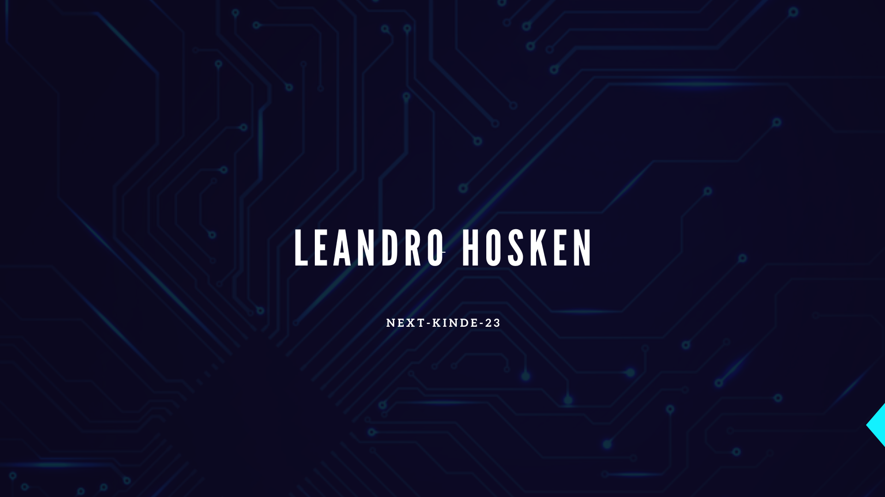
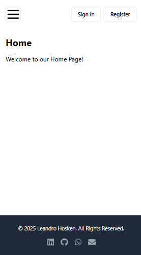
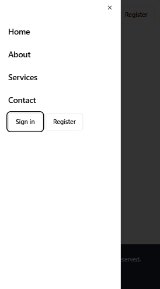
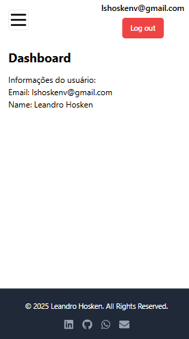
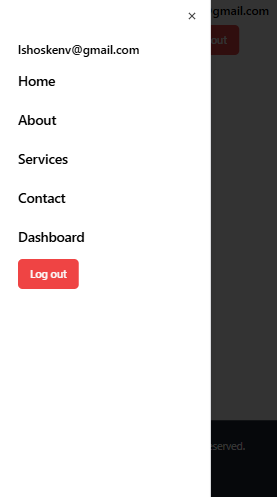
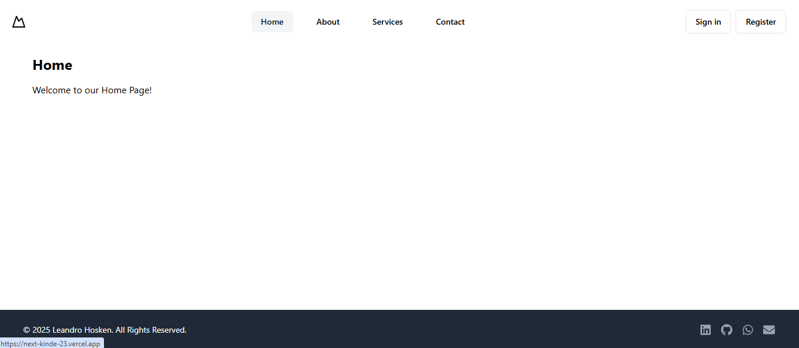

 

[English](#personal-project-next-kinde---23) | [Português](#projeto-pessoal-next-kinde---23) | [Images](#images)  

# Personal Project Next Kinde - 23

This is a personal project aimed at improving my skills in Next.js and exploring the use of the authentication tool Kinde. It also provides another opportunity to refine my Tailwind CSS and ShadCN skills.

## 📁 Project Access  
[See the final project in action](https://next-kinde-23.vercel.app/).

## ✔️ Techniques and technologies used  
- **HTML/CSS**: Used for structuring and styling the application.  
- **TypeScript**: Adds static typing to JavaScript, improving code reliability and maintainability.  
- **Next.js**: A powerful framework for rendering static and dynamic pages with excellent performance.  
- **Next.js Pagination**: Implemented to efficiently organize and display data across multiple pages.  
- **Environment Variables**: Configured to securely store and protect API keys.  
- **ShadCN UI**: Utilized to create modern, accessible, and visually appealing components like the Navbar.  
- **Tailwind CSS**: Applied for rapid styling and building responsive layouts with utility-first classes.  
- **Git/GitHub**: Essential tools for version control and collaborative code hosting.  
- **Vercel**: Deployment platform used to publish and host the project seamlessly.  
- **Kinde**: Integrated for user authentication and access management.  
- **Middleware**: Implemented with Kinde to protect and manage route access securely.  

---

# Projeto Pessoal Next Kinde - 23

Este é um projeto pessoal com o objetivo de aprimorar minhas habilidades em Next.js e explorar o uso da ferramenta de autenticação Kinde. Também é uma oportunidade para aperfeiçoar minhas habilidades com Tailwind CSS e ShadCN.

## 📁 Acesso ao projeto  
[Veja o projeto final do curso em funcionamento](https://next-kinde-23.vercel.app/).

## ✔️ Técnicas e tecnologias utilizadas  
- **HTML/CSS**: Utilizado para estruturar e estilizar a aplicação.  
- **TypeScript**: Adiciona tipagem estática ao JavaScript, melhorando a confiabilidade e a manutenção do código.  
- **Next.js**: Um framework poderoso para renderização de páginas estáticas e dinâmicas com excelente desempenho.  
- **Paginação no Next.js**: Implementada para organizar e exibir dados de forma eficiente em várias páginas.  
- **Variáveis de Ambiente**: Configuradas para armazenar e proteger chaves de API com segurança.  
- **ShadCN UI**: Utilizado para criar componentes modernos, acessíveis e visualmente atraentes, como a Navbar.  
- **Tailwind CSS**: Aplicado para estilização rápida e construção de layouts responsivos com classes utilitárias.  
- **Git/GitHub**: Ferramentas essenciais para controle de versão e hospedagem colaborativa de código.  
- **Vercel**: Plataforma de implantação utilizada para publicar e hospedar o projeto de forma eficiente.  
- **Kinde**: Integrado para autenticação de usuários e gerenciamento de acessos.  
- **Middleware**: Implementado com Kinde para proteger e gerenciar o acesso às rotas com segurança.  

---

## Images

  
  
  
  
  

